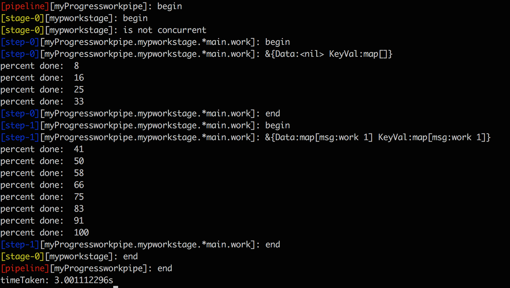

Pipeline is a package to build multi-staged concurrent workflows with a centralized logging output.

The package could be used to define and execute CI/CD tasks(either sequential or concurrent). A tool with similar goals
would be [Jenkins Pipeline](https://jenkins.io/doc/book/pipeline/overview/). However, compared to Jenkins Pipeline, this package has
fewer constructs since the logic is specified in code, as opposed to a [Jenkinsfile](https://jenkins.io/doc/book/pipeline/jenkinsfile/).

It's tiny by design and is valuable when used as a glue rather than a container.

#### go get
```
$ go get github.com/myntra/pipeline
```
#### Concepts

 The package has three building blocks to create workflows : Pipeline, Stage and Step . A pipeline is a collection of stages and a stage is a
 collection of steps. A stage can have either concurrent or sequential steps, while stages are always sequential.


The step block is where the actual work is done. Stage and pipeline act as flow governors.

#### The Step Interface

Step is the unit of work which can be concurrently or sequentially staged with other steps. To do that, we need to implement the
`Step` interface.

```go
type Step interface {
	Out
	Exec(*Request) *Result
	Cancel() error
}
```

To satisfy the interface we need to embed `pipeline.StepContext` and implement `Exec(*Request)*Result`, `Cancel()error` methods in the
target type. For e.g:

```go
type work struct {
	pipeline.StepContext
}

func (w work) Exec(request *pipeline.Request) *pipeline.Result {
	return &pipeline.Result{}
}

func (w work) Cancel() error {
	return nil
}
```

The `pipeline.StepContext` type provides a `Status` method which can be used to log to the `out` channel. The current step receives a
`Request` value passed on by the previous step. Internally data(`Request.Data` and `Request.KeyVal`) is copied from the previous step's
`Result`.

#### Usage

```go
package main

import (
	"fmt"
	"time"

	"github.com/myntra/pipeline"
)

type work struct {
	pipeline.StepContext
	id int
}

func (w work) Exec(request *pipeline.Request) *pipeline.Result {
	w.Status(fmt.Sprintf("%+v", request))

	duration := time.Duration(1000 * w.id)
	time.Sleep(time.Millisecond * duration)
	msg := fmt.Sprintf("work %d", w.id)

	return &pipeline.Result{
		Error:  nil,
		Data:   struct{msg string}{msg:msg},
		KeyVal: map[string]interface{}{"msg": msg},
	}
}

func (w work) Cancel() error {
	w.Status("cancel step")
	return nil
}

func readPipeline(pipe *pipeline.Pipeline) {
	out, err := pipe.Out()
	if err != nil {
		return
	}

	progress, err := pipe.GetProgressPercent()
	if err != nil {
		return
	}

	for {
		select {
		case line := <-out:
			fmt.Println(line)
		case p := <-progress:
			fmt.Println("percent done: ", p)
		}
	}
}

func main() {

	workpipe := pipeline.NewProgress("myProgressworkpipe", 1000, time.Second*3)
	stage := pipeline.NewStage("mypworkstage", false, false)

	step1 := &work{id: 1}
	step2 := &work{id: 2}

	stage.AddStep(step1)
	stage.AddStep(step2)

	workpipe.AddStage(stage)

	go readPipeline(workpipe)

	err := workpipe.Run()
	if err != nil {
		fmt.Println(err)
	}

	fmt.Println("timeTaken:", workpipe.GetDuration())
}

```

Check `examples` directory for more.


#### Logging and Progress

- `pipeline.Out()` : Get all statuses/logs.
- `pipeline.Progress` : Get progress in percentage.

Output of the above example:



#### Documentation

[godoc](https://godoc.org/github.com/myntra/pipeline)
